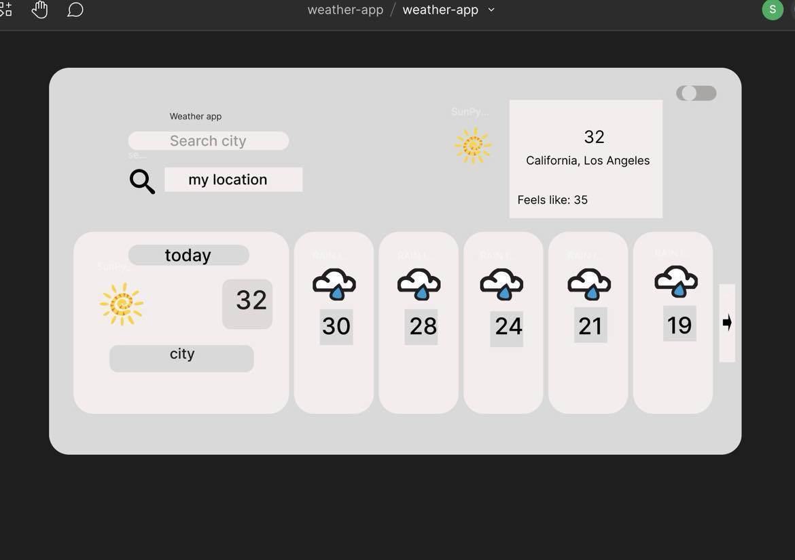

# Welcome to the Weather Web App!

This application provides real-time weather data and forecasts for specific locations. Designed with user experience in mind, our app ensures that you stay informed and prepared for various weather conditions.

## Features

- **Real-Time Weather Data:**
- Access to the weather information for your selected location.
- **5-Day Weather Forecast:** 
- Get an extended forecast to plan your week ahead.
- **Weather API Integration:**
- We use a reliable weather API to fetch accurate and up-to-date weather data.

------

## Design

The design of the Weather Web App was crafted using Figma, focusing on a user-friendly interface and seamless user experience. The clean and intuitive design helps users quickly find the information they need.

## Technologies Used

- **HTML:**
- For structuring the web pages.
- **CSS:**
- For styling and layout.
- **Javascript:**
- For dynamic content and interactions.

# API integration

This web app uses the OpenWeatherMap API to fetch real-time weather data and forecasts. You will need an API key to access the weather data.

## Configuring the API Key

### Sign Up for an API Key: 

Register on the OpenWeatherMap website and get your API key.

### Add the API Key to our Project:

- open main.js
- Replace 'apiKey' with your actual API key.